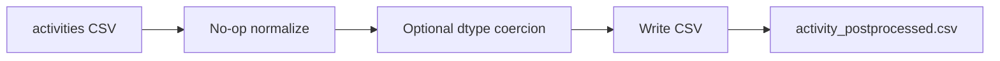

# Обзор пайплайна `scripts/get_activity_data.py`

// Changelog: initial reverse-engineering report for get_activity_data pipeline.

## A. Краткий итог
1. Скрипт запускается как CLI (`python scripts/get_activity_data.py --config path [--out path]`) и экспортирует CSV без дополнительных стадий обработки.【F:scripts/get_activity_data.py†L30-L46】
2. Единственный источник данных — CSV с активностями ChEMBL, путь задаётся ключом `files.activity_csv` в `config.yaml`; никаких других таблиц не читается.【F:scripts/get_activity_data.py†L22-L27】【F:config.yaml†L10-L20】
3. Нормализация сведена к вызову `normalize_activity_frame`, который только копирует строки и опционально приводит типы через `coerce_types`; по умолчанию маппинг типов пустой.【F:scripts/get_activity_data.py†L22-L27】【F:library/transforms/activity.py†L16-L28】
4. Нет джойнов с `assays`, `targets`, `molecule_dictionary` или внешними словарями; никакой lineage за пределами исходного CSV не фиксируется.【F:scripts/get_activity_data.py†L22-L27】
5. Фильтры качества, обработка `data_validity_comment`, `potential_duplicate` и цензуры отсутствуют; вывод полностью наследует содержимое входа.【F:library/transforms/activity.py†L10-L28】
6. Нормализация единиц/типов активности не реализована: `standard_type`, `standard_units`, `standard_relation` и `pchembl_value` не преобразуются и не проверяются.【F:library/transforms/activity.py†L10-L28】
7. Агрегация и дедупликация не выполняются; возможные дубликаты из источника сохраняются как есть.【F:library/transforms/activity.py†L10-L28】
8. Выход — CSV `activity_postprocessed.csv` в каталоге `outputs.dir` (по умолчанию `data/output`), разделитель и кодировка берутся из секции `io` конфигурации.【F:scripts/get_activity_data.py†L41-L46】【F:library/io.py†L227-L250】【F:config.yaml†L22-L33】【F:config.yaml†L317-L320】
9. Обработка ошибок ограничена механизмом `read_csv`/`write_csv` (fallback по датам, попытки декодирования, создание каталогов); специфические проверки активности отсутствуют.【F:library/io.py†L167-L250】
10. Производительность ограничивается чтением/записью pandas и линейным преобразованием списком; дополнительных оптимизаций не требуется, но и функциональности по очистке нет.【F:library/transforms/activity.py†L16-L28】

## B. Подробный отчёт

### 1. Точки входа и зависимости
- **CLI**: `main()` парсит аргументы `--config` (обязателен) и `--out` (переопределяет путь вывода).【F:scripts/get_activity_data.py†L30-L45】
- **Импортируемая функция**: `get_activity_data(config)` может вызываться из других модулей и возвращает `pd.DataFrame` без побочных эффектов записи.【F:scripts/get_activity_data.py†L22-L27】
- **Конфигурация**: читается через `library.config.load_config`, который поддерживает экранирование Windows-путей.【F:scripts/get_activity_data.py†L15-L37】【F:library/config.py†L19-L83】
- **Внутренние зависимости**: `library.io.read_csv`/`write_csv`, `library.transforms.activity.normalize_activity_frame`, `library.validators.coerce_types` (через `normalize_activity_frame`).【F:scripts/get_activity_data.py†L15-L27】【F:library/transforms/activity.py†L16-L28】【F:library/validators.py†L37-L57】
- **Словари**: ни один файл из `dictionary/*` не загружается; конфигурация не задаёт `pipeline.activity`, поэтому карта типов пустая.【F:scripts/get_activity_data.py†L24-L26】【F:config.yaml†L42-L316】

### 2. Входные источники и схемы
- **activities CSV**: путь берётся из `files.activity_csv`; формат — CSV. Скрипт не декларирует схему, не проверяет обязательные столбцы и не меняет типы, кроме опционального `type_map`. Пример ожидаемых полей (по стандарту ChEMBL) приходится считать предположением; фактическая схема зависит от входного файла (UNKNOWN).【F:scripts/get_activity_data.py†L22-L27】【F:config.yaml†L10-L20】
- Дополнительные таблицы (`assays`, `targets`, `molecule_dictionary`, словари единиц) **не загружаются** — их схемы не участвуют (N/A).【F:scripts/get_activity_data.py†L22-L27】

### 3. Карта пайплайна по стадиям
| Stage | Описание | Псевдокод | Ссылки |
|-------|----------|-----------|--------|
| S1 | Загрузка CSV | `activity_df = read_csv("activity_csv", config)` | 【F:scripts/get_activity_data.py†L22-L24】【F:library/io.py†L167-L204】 |
| S2 | Построение type_map | `type_map = config.pipeline.activity.type_map or {}` (результат пустой) | 【F:scripts/get_activity_data.py†L24-L25】【F:config.yaml†L42-L316】 |
| S3 | Нормализация строк | `normalized_rows = [dict(row) for row in frame.to_dict("records")]` | 【F:library/transforms/activity.py†L16-L25】 |
| S4 | Коэрция типов | `normalized = coerce_types(normalized, type_map)` (применяется только если map не пустой) | 【F:library/transforms/activity.py†L25-L27】【F:library/validators.py†L37-L57】 |
| S5 | Возврат результатов | `return normalized` | 【F:scripts/get_activity_data.py†L26-L27】 |
| S6 | Определение пути вывода | `output_path = args.out or Path(outputs.dir)/"activity_postprocessed.csv"` | 【F:scripts/get_activity_data.py†L41-L45】【F:config.yaml†L317-L320】 |
| S7 | Запись CSV | `write_csv(result, output_path, config)` | 【F:scripts/get_activity_data.py†L45-L46】【F:library/io.py†L227-L250】 |
| S8 | Логирование завершения | `logging.info("Activity data export completed", extra={...})` | 【F:scripts/get_activity_data.py†L45-L46】 |
| S9 | Отсутствуют дополнительные стадии (фильтры, агрегация, сортировка не реализованы) | N/A | — |

### 4. Нормализация единиц и типов
- **standard_type**: не трансформируется; `normalize_activity` возвращает `dict(record)` без правок. (UNKNOWN — нет маппинга канонических типов).【F:library/transforms/activity.py†L10-L28】
- **standard_units**: не приводятся к канону; отсутствует код по конвертации. (NONE).【F:library/transforms/activity.py†L10-L28】
- **standard_relation / upper/lower_value**: не обрабатываются, полная поддержка цензурированных значений отсутствует. (NONE).【F:library/transforms/activity.py†L10-L28】
- **pChEMBL**: не пересчитывается; любые значения копируются как есть, либо остаются пустыми. Формула не реализована. (NONE).【F:library/transforms/activity.py†L10-L28】
- Итог: стадия нормализации единиц/типов отсутствует; любые требования бизнес-логики ChEMBL остаются невыполненными.

### 5. Фильтры качества
- **data_validity_comment**: отсутствуют whitelist/blacklist.
- **potential_duplicate**: не анализируется.
- **assay_type / confidence_score / relationship_type**: данные столбцы даже не читаются (нет соединений с assay).
- **Типы/единицы**: нет проверок допустимых значений.
- Вывод: никаких фильтров качества не реализовано (все записи проходят).

### 6. Джойны и ключи
Скрипт не выполняет join-операций, таблица пустая (см. раздел C ниже). Любые связи с assay/target/molecule должны реализовываться в другом месте или отсутствуют.

### 7. Агрегация и дедупликации
- Не вызывается `drop_duplicates`, `groupby` или иные агрегаторы.
- Гранулярность уникальности полностью определяется источником. Обработка повторов (`potential_duplicate`, усреднение IC50 и т.п.) отсутствует.

### 8. Линейдж колонок
См. таблицу в разделе C: все колонки — прямой passthrough из CSV, без трансформаций.

### 9. Бизнес-правила
- **Приоритет типов активности**, **разрешение конфликтов target**, **обработка outliers**, **политика NA** — не реализованы. Значения остаются как в источнике.

### 10. Сортировка и вывод
- **Сортировка**: не выполняется; порядок строк соответствует порядку в CSV.
- **Формат**: CSV, разделитель `io.delimiter`, кодировка `io.encoding_out`, line terminator `outputs.line_terminator` (по умолчанию `\n`).【F:library/io.py†L227-L250】【F:config.yaml†L22-L27】【F:config.yaml†L317-L320】
- **Имя файла**: `activity_postprocessed.csv` в `outputs.dir` (по умолчанию `data/output`). Путь можно переопределить `--out`.
- **Гарантии**: уникальность ключей не проверяется.

### 11. Конфигурация
- Используемые ключи: `source.kind`, `source.base_path`, `files.activity_csv`, `io.encoding_in`, `io.encoding_out`, `io.delimiter`, `io.na_values`, `io.quoting`, `outputs.dir`, `outputs.line_terminator`, опционально `outputs.overwrite` (не читается напрямую, но существует).【F:library/io.py†L32-L250】【F:scripts/get_activity_data.py†L22-L46】【F:config.yaml†L1-L33】【F:config.yaml†L317-L320】
- Неиспользуемые секции: `pipeline.activity` отсутствует; остальные подсекции (`document`, `testitem`, `assay`, `target`) не затронуты. Можно считать несогласованностью документации.

### 12. Качество, логирование, ошибки
- **Логирование**: на уровне INFO/DEBUG — сообщения о загрузке/записи, fallback путях, неудачных декодированиях.【F:library/io.py†L167-L250】
- **Проверки**: нет assert на схему, уникальность, диапазоны.
- **Поведение при сбоях**: `read_csv` кидает `LoaderError` при отсутствии файла/неподдерживаемом источнике, либо пробрасывает `UnicodeDecodeError` после перебора кодировок. SharePoint не поддерживается (исключение). `write_csv` гарантирует создание каталогов. Сбой при коэрции типов приводит к стандартным ошибкам pandas.

### 13. Производительность
- Основные затраты — `pd.read_csv` и создание списка словарей (`frame.to_dict("records")`), что удваивает использование RAM (весь DataFrame + список копий). Для больших наборов данных это узкое место.
- Нет повторных join/merge; загрузка выполняется один раз.
- Потенциальные улучшения: использовать `frame.copy()` вместо преобразования в список, избегая дополнительного буфера; добавить потоковую обработку или прямую коэрцию типов без промежуточного списка; опционально включить `usecols`/`dtype` при чтении.
- Оценка RAM: O(n * m) для чтения + ещё O(n * m) при конвертации в записи; при 10 млн строк с ~50 колонками память удваивается.

### 14. Тестовые примеры
```text
Вход (activities.csv):
activity_id,assay_id,molecule_chembl_id,standard_type,standard_value,standard_units,standard_relation
1,10,CHEMBL1,IC50,5,nM,"="
2,10,CHEMBL1,IC50,0.5,uM,"<"

Ожидаемый вывод:
activity_id,assay_id,molecule_chembl_id,standard_type,standard_value,standard_units,standard_relation
1,10,CHEMBL1,IC50,5,nM,"="
2,10,CHEMBL1,IC50,0.5,uM,"<"
```
Все поля сохраняются без изменений, `pchembl_value` не рассчитывается, `is_censored` отсутствует.

Краевые случаи: записи с `standard_value` = NA, нестандартными единицами, противоречивыми `standard_type`/`pchembl_value`, дубликаты по (molecule, assay) — все остаются неизменными.

## C. Таблицы lineage и join

### Линейдж колонок
| OutputColumn | Тип | Источник | Трансформация | Nullable | Ограничения | Комментарий |
|--------------|-----|----------|---------------|----------|-------------|-------------|
| *Любая колонка из входного CSV* | UNKNOWN | `activities` CSV | Прямое копирование через `dict(record)` | Не контролируется | Не проверяются | Скрипт не знает о схеме; ответственность на источнике.【F:library/transforms/activity.py†L16-L28】 |

### Join-операции
| Stage | Left | Right | Ключи | Тип | Кардинальность | Пред-/постфильтры | Разбор конфликтов |
|-------|------|-------|-------|-----|----------------|--------------------|--------------------|
| — | — | — | — | — | — | Джойны не выполняются | — |

## D. JSON-артефакт
```json
{
  "inputs": [
    {
      "name": "activities",
      "path": "files.activity_csv",
      "schema": "UNKNOWN"
    }
  ],
  "stages": [
    {
      "id": "S1",
      "desc": "Read activities CSV via read_csv",
      "code_refs": ["scripts/get_activity_data.py:22-24", "library/io.py:167-204"]
    },
    {
      "id": "S2",
      "desc": "No-op normalization (copy records)",
      "code_refs": ["library/transforms/activity.py:16-25"]
    },
    {
      "id": "S3",
      "desc": "Optional dtype coercion using config pipeline.activity.type_map (currently empty)",
      "code_refs": ["library/transforms/activity.py:25-27", "config.yaml:42-316"]
    },
    {
      "id": "S4",
      "desc": "Write dataframe to CSV",
      "code_refs": ["scripts/get_activity_data.py:41-46", "library/io.py:227-250"]
    }
  ],
  "columns": [
    {
      "output": "*",
      "sources": ["activities.*"],
      "transform": "passthrough via dict(record)",
      "nullable": "unknown"
    }
  ],
  "joins": [],
  "filters": [],
  "config_used": [
    "source.kind",
    "source.base_path",
    "files.activity_csv",
    "io.encoding_in",
    "io.encoding_out",
    "io.delimiter",
    "io.na_values",
    "io.quoting",
    "outputs.dir",
    "outputs.line_terminator"
  ],
  "outputs": [
    {
      "path": "outputs.dir/activity_postprocessed.csv (overridable via --out)",
      "primary_key": "not enforced"
    }
  ]
}
```

## E. Диаграмма потока


## F. Команды подтверждения поиска
- `rg -n "read_csv|read_parquet" scripts/get_activity_data.py`【a13086†L1-L3】
- `rg -n "standard_value|standard_units|pchembl|relation|data_validity_comment" -S scripts/`【75e8c7†L1-L2】
- `rg -n "assay_id|target_chembl_id|molecule_chembl_id" -S scripts/get_activity_data.py`【b4108b†L1-L1】

