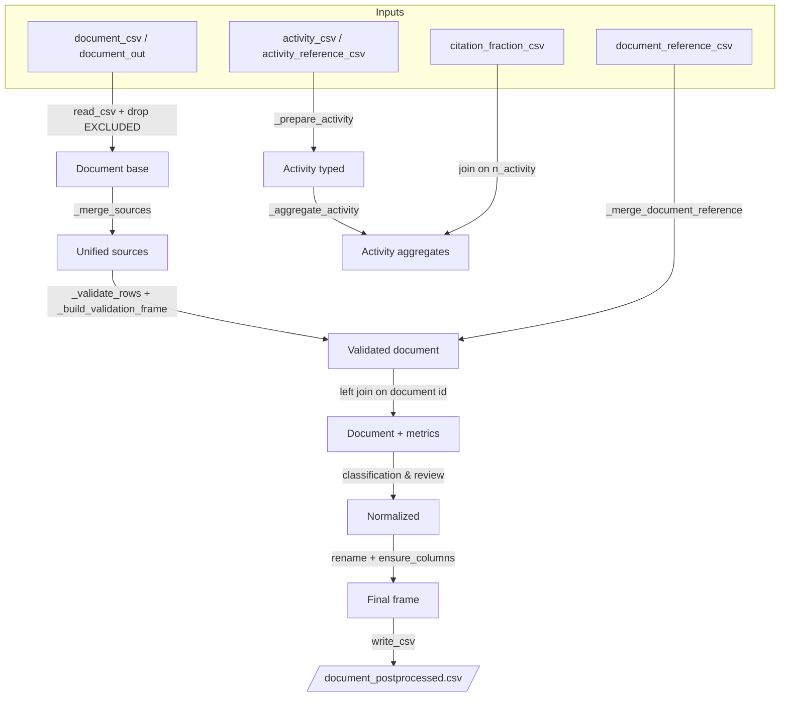

# get_document_data.py Pipeline Documentation

## Краткий итог
- Скрипт `scripts/get_document_data.py` работает как CLI‑утилита: читает YAML-конфиг, вытягивает связанные CSV, прогоняет нормализацию документа и сохраняет результат в `document_postprocessed.csv`, путь может быть переопределён `--out`.
- Функция `get_document_data` подбирает ключи файлов через `_resolve_key`, загружает CSV через общий слой `library.io.read_csv`, убирает шумовые колонки и возвращает словарь DataFrame’ов, из которых строится последующая трансформация.
- Нормализация документа начинается с `_merge_sources`: приводятся к единым именам колонки `PubMed`, `ChEMBL`, `crossref`, `scholar`, `OpenAlex`, понижает регистр, собирает номера страниц и вычищает PMID до цифр.
- `_validate_rows` и `_build_validation_frame` сводят DOI из разных источников, выбирают согласованное значение, вычисляют флаги качества (`invalid_record`), формируют `completed` и `sort_order`, удаляют служебный шум и переименовывают поля к целевому виду.
- `_merge_document_reference` присоединяет справочник по очищенному PMID и консолидирует флаги `review`, `document_contains_external_links`, `is_experimental_doc` с приоритетом справочника.
- `_prepare_activity` и `_aggregate_activity` приводят активити к схеме, считают количество активностей, уникальных ассев и тестовых объектов, накладывают справочные пороги значимости цитирований.
- Бизнес-правила (`clean_pipe`) и вычисление `review` используют конфигурацию: алиасы/дропы для pipe-колонок и параметры голосования (база, порог, реакция на респонсы) приводят к итоговым булевым полям `review` и `is_experimental`.
- Финальный слой гарантирует схему и порядок: `ensure_columns`, `coerce_types`, `rename_map`, `zero_pad`, `column_order` формируют готовый DataFrame перед выгрузкой.
- Слой IO обрабатывает пути, fallback-директории, подбор кодировок, а `write_csv` применяет опции разделителя, quoting и завершается логированием успеха.
- Конфиг `config.yaml` задаёт пути файлов, настройки IO, классификационные правила, параметры расчёта обзора и требуемую схему выхода.

## Подробный отчёт

### 1. Точки входа и запуск
`main()` создаёт CLI через `argparse`, требует `--config`, опционально `--out`, загружает YAML `load_config`, затем вызывает `get_document_data`, `normalize_document` и `write_csv`. Логирование включено на уровне INFO, завершение помечается сообщением «Document post-processing completed». Модуль может импортироваться, так как основные функции экспортированы; при прямом запуске действует guard `if __name__ == "__main__"`. Для доступа к внутренним библиотекам добавляется `PROJECT_ROOT` в `sys.path`.

### 2. Зависимости
Внешние библиотеки: `pandas`, `argparse`, `logging`, стандартные `Path`, `sys`, `typing`. Внутренние модули: `library.config.load_config` (парсинг YAML с защитой от неэкранированных путей), `library.io.read_csv/write_csv` (абстракция загрузки/выгрузки), `library.transforms.document.normalize_document` (весь пайплайн нормализации). Дополнительные зависимости внутри трансформации: `library.transforms.common` (`to_text`, `clean_pipe`) и `library.validators` (`ensure_columns`, `coerce_types`).

### 3. Входные источники
Файлы перечислены в `config.yaml`: производственные пути для `document_csv`, `document_reference_csv`, `activity_reference_csv`, `activity_csv`, `citation_reference_csv` и проч. Все форматы — CSV, кодировка и разделитель задаются в секции `io`. Справочник документов содержит `document_chembl_id`, `classification`, `document_contains_external_links`, `is_experimental_doc` (значения TRUE/FALSE). Активности включают `activity_chembl_id`, `assay_chembl_id`, `document_chembl_id`, `is_citation`, `molecule_chembl_id`, `target_chembl_id`. Пороговая таблица `citation_fraction` даёт поля `N`, `K_min_significant`, `test_used_at_threshold`, `p_value_at_threshold`. Исходный `document_out` ожидается с колонками `PubMed.*`, `crossref.*`, `OpenAlex.*`, `scholar.*`, `ChEMBL.*` и др., упомянутыми в `_merge_sources`.

### 4. Чтение источников и обработка ошибок
`_resolve_key` выбирает первый доступный ключ из списка кандидатов, при отсутствии возвращает последний (рискуя перейти к отсутствующему ключу). `_drop_columns` удаляет присутствующие в `EXCLUDED_COLUMNS` поля (в т.ч. `citations`, `significant_citations_fraction`) для предотвращения повторного использования устаревших вычислений. `read_csv` строит путь из `source.kind` и `files[...]`, ищет fallback-директории (`source.fallback_dirs` по умолчанию `data/input`), перебирает список кодировок (`encoding_in` + fallback) и логирует ошибки; при недоступности файла бросает `LoaderError`, при SharePoint — не реализовано. HTTP-источники обрабатываются аналогично, меняется только построение URL; UnicodeDecodeError перехватывается с логированием и переходом к следующей кодировке.

### 5. Карта стадий пайплайна (S1–S9)

| Стадия | Описание и псевдокод |
|---|---|
| **S1 Загрузка** | CLI → `config = load_config(args.config)`; `frames = {k: read_csv(key)}`; `document_df = read_csv("document_csv")`; `_drop_columns(document_df, EXCLUDED_COLUMNS)`.
| **S2 Нормализация источников** | `_merge_sources(document_out)` переименовывает колонки, приводит регистр, собирает `page`, очищает `authors`, строит `PMID` по приоритетам (`PMID_SOURCES`).
| **S3 Джойны** | `_validate_rows` производит row-wise анализ DOI, добавляет метаданные; `_build_validation_frame` удаляет шум, формирует `completed`, `sort_order`, переименовывает поля; при наличии справочника `_merge_document_reference(document_df, reference)` объединяет по `_pmid_key` (очищенный PMID) левым соединением.
| **S4 Фильтры** | При подготовке активностей: `activity = activity[document_chembl_id.notna()]`; справочник документов фильтруется по непустому `pubmed_id`; DOI, объём и выпуск помечают `invalid_doi`, `invalid_volume`, `invalid_issue` для последующих проверок.
| **S5 Агрегирование** | `_prepare_activity` гарантирует схему, `_aggregate_activity` считает `n_activity`, `citations`, `n_assay`, `n_testitem`, присоединяет `thresholds` по `n_activity` и вычисляет `significant_citations_fraction`.
| **S6 Вычисляемые поля** | `_build_completed`, `_build_sort_order`, вычисление `invalid_record`, подбор `selected_doi`, выбор `title`/`abstract`/`page`, преобразование `volume`/`issue`; на этапе `normalize_document` добавляется `n_responces`, `review`, `is_experimental`.
| **S7 Дедупликации** | `clean_pipe` удаляет дубли токенов в pipe-списках, сохраняя порядок при `sort=False` и применяя alias/drop из конфига; DOI источников очищаются от дубликатов через `distinct_preserving`.
| **S8 Сортировки** | Явной сортировки DataFrame нет; рассчитывается поле `sort_order`, а финальная перестановка колонок делается через `column_order` без изменения порядка строк.
| **S9 Вывод** | `write_csv(result, output_path, config)` применяет настройки IO, создаёт директорию, пишет CSV; логирует путь.

### 6. Джойны и ключи
Основные соединения собраны в таблице ниже (см. «Таблица джойнов»). Кратко:
- Document + reference: левое соединение по очищенному PMID; если колонка `pubmed_id` отсутствует, шаг пропускается для безопасности.
- Aggregates + thresholds: левое соединение по `n_activity`; отсутствующие пороги приводят к `NaN`, затем в коде приводятся к 0 перед расчётом булевого признака.
- Document + aggregates: левое соединение по `document_id_column` (выбирается из доступных `ChEMBL.document_chembl_id`/`document_chembl_id`/`document_id`), с переименованием ключа при несоответствии, пустые ID приводят к пропуску с warning.

### 7. Нормализация и бизнес-правила
- DOI: `_normalize_doi` режет префиксы `doi:`, `https://doi.org/`, декодирует `%2F`, проверяет наличие `10.` и длину 5–300, иначе возвращает `None`.
- Pipe-списки: `clean_pipe` снижает регистр, применяет alias/drop из `pipeline.document.classification_rules`, удаляет повторения, опционально сортирует (в правилах выставлено `sort=False`).
- `completed`: собирается из полей `PubMed.YearCompleted/Month/Day` → `YYYY-MM-DD`; при отсутствии берёт `PubMed.YearRevised`, далее `ChEMBL.year`, иначе `0000-00-00`.
- `sort_order`: `f"{ISSN_or_unknown}:{completed_or_default}:{PMID_zfilled}"` с заменой `<NA>` на пустые строки, дефолты `unknown`, `0000-00-00`, `00000000`.
- `review`: голосование по типам публикаций (`review`-подстроки) плюс базовый вес (конфиг `base_weight=2`), делится на `n_responces` (количество непустых ответов из `response_columns` + базовый вес) и сравнивается с `threshold=0.335`.
- `is_experimental`: просто инверсия `review`.

### 8. Фильтры, дедупликации, сортировки
- Активности с пустым `document_chembl_id` удаляются перед агрегацией.
- Справочник документов удаляет записи с пустым `pubmed_id` после очистки, предотвращая присоединение пустых ключей.
- В `clean_pipe` (настройки: drop `journal article`, `article`, др.) исключены «шумовые» типы публикаций, чтобы оставлять только значимые категории.
- Колонки `significant_citations_fraction`, `citations`, `n_responces`, `document_contains_external_links`, `is_experimental_doc` удаляются перед финальным выводом (из `REMOVED_OUTPUT_COLUMNS`).
- Строки не сортируются; порядок сохраняется как в исходном DataFrame.

### 9. Проверки качества и обработка ошибок
- `_build_validation_frame` помечает `invalid_record`, если поддержка DOI ≤2 либо есть проблемы с номером выпуска/тома.
- Консолидация булевых флагов (`review`, `document_contains_external_links`, `is_experimental_doc`) происходит через `combine_first`, приоритет у справочника; типы приводятся к `boolean`.
- `coerce_types`/`ensure_columns` гарантируют наличие и типы колонок, при отсутствии создают `NA` с нужным dtype либо приводят значения, преобразуя `true/false` строки в булевы типы.
- Логирование: начало постобработки (`logger.info`), предупреждение при пропущенном идентификаторе документа, предупреждения по декодированию CSV (`logger.warning`).
- `LoaderError` выбрасывается при отсутствии файла, неподдерживаемом `source.kind`, неизвестном quoting.
- `load_config` перехватывает `yaml.YAMLError` с неизвестными escape, делает повторную попытку с экранированием бэкслешей, иначе бросает `ValueError` с подсказкой.

### 10. Производительность
- `_validate_rows` и `_merge_sources` используют `iterrows()` и списковые операции по строкам (`pmid_values`, `records`), что приводит к O(n) Python-петлям и может стать узким местом на больших объёмах данных. Векторизация (например, через `apply`/`Series.str`) или предварительная подготовка массивов могла бы снизить overhead.
- `clean_pipe` применяется колонка‑wise, но внутри тоже проходят по токенам (O(k) на строку); кэширование alias/drop между вызовами уже реализовано через предобработку.
- `coerce_types` и `ensure_columns` копируют DataFrame, что удваивает использование памяти (пиково ≈2× размер таблицы). Возможна оптимизация за счёт in-place преобразований.
- Повторное чтение `document_ref_df`/`document_out_df` избегается за счёт reuse, если ключ совпадает (ветка reuse в `get_document_data`).
- Группировки в `_aggregate_activity` используют `groupby` с `dropna=False`, что может потребовать дополнительных ресурсов, но эффективны благодаря C-интерфейсу pandas.
- Рекомендации: вынести расчёт DOI и сортировок в векторные функции, кэшировать результаты `to_text` для колонок, минимизировать копии DataFrame и рассмотреть `Table.Buffer` эквиваленты в M‑коде, если портировать.

### 11. Выходные артефакты
- Основной артефакт: CSV `document_postprocessed.csv` в директории `outputs.dir` (`data/output` по умолчанию), создаётся при необходимости; путь можно переопределить аргументом `--out`.
- Схема и порядок колонок определены `pipeline.document.column_order` и `type_map` (см. таблицу lineage). Уникальность ключа не гарантируется, но `sort_order` и `ChEMBL.document_chembl_id` предоставляют комбинацию для дальнейшего контроля.
- Побочных артефактов (временных файлов, логов) скрипт не создаёт; логирование идёт в STDOUT через `logging.basicConfig`.

### 12. Конфигурация, тесты и примеры
**Используемые ключи конфига:**
- `files.*` для всех путей, включая `document_csv`, `document_reference_csv`, `activity_reference_csv`, `activity_csv`, `citation_reference_csv`.
- `source.kind`, `source.base_path`, `source.fallback_dirs`, `source.http_base`, `source.sharepoint.*` — влияют на построение путей и fallback’и в `read_csv`.
- `io.encoding_in/out`, `io.delimiter`, `io.quoting`, `io.na_values`, `io.encoding_errors` — применяются при чтении/записи CSV.
- `outputs.dir`, `outputs.line_terminator`, `outputs.overwrite` (последнее не используется напрямую в коде) — параметры вывода.
- `pipeline.document.classification_rules`, `.review.*`, `.rename_map`, `.type_map`, `.column_order`, `.formatters.zero_pad` — используются в `_apply_classification_rules`, расчёте `review`, финальной типизации и порядке колонок.

**Мини-пример для регрессионной проверки:**

| Набор | Мини-вход |
|---|---|
| `document_out` | `PubMed.DOI="https://doi.org/10.1000/xyz"`, `PubMed.ArticleTitle="Cancer Study"`, `PubMed.Abstract="Key Findings"`, `PubMed.PublicationType="Journal Article|Review"`, `PubMed.MeSH_Descriptors="Pain|Nerves"`, `PubMed.MeSH_Qualifiers="Severe"`, `PubMed.ChemicalList="Aspirin|Ibuprofen"`, `PubMed.PMID="PMID:12345"`, `ChEMBL.authors="Smith J|Doe A"`, `ISSN="1234-5678"`, `PubMed.YearCompleted="2020"`, `PubMed.MonthCompleted="5"`, `PubMed.DayCompleted="6"`, `crossref.Type="journal-article"`, `OpenAlex.DOI="10.1000/xyz"`, `ChEMBL.doi="10.1000/xyz"` |
| `document_reference` | `document_chembl_id="CHEMBL1"`, `classification=1`, `document_contains_external_links=FALSE`, `is_experimental_doc=TRUE`, `pubmed_id="12345"` |
| `activity` | две строки с `document_chembl_id="CHEMBL1"`, `assay_chembl_id="ASSAY1/ASSAY2"`, `molecule_chembl_id="CHEM1/CHEM2"`, `is_citation=TRUE/FALSE` |
| `citation_fraction` | строка `N=2`, `K_min_significant=1` |

**Ожидаемые ключевые выходы:**
- `PMID=12345`, `doi=10.1000/xyz`, `completed=2020-05-06`, `sort_order=1234-5678:2020-05-06:00012345`, `n_activity=2`, `n_assay=2`, `n_testitem=2`, `PubMed.publication_type="review"`, `review=True`, `is_experimental=False`.

**Инварианты/ассершены:**
- `doi` пустой или начинается с `10.` и содержит `/`.
- `completed` всегда соответствует маске `\d{4}-\d{2}-\d{2}`.
- `n_activity`, `n_assay`, `n_testitem` — неотрицательные целые.
- `review` и `is_experimental` взаимоисключающие (`not review == is_experimental`).

**Краевые случаи:**
- Пустые CSV → функции возвращают пустые DataFrame (ветки `.empty`), итоговый вывод — пустая таблица с правильной схемой благодаря `ensure_columns`.
- Отсутствие `document_chembl_id` → warning, агрегаты не присоединяются, числовые колонки остаются пустыми/NA.
- Невалидные DOI → `selected_doi=None`, `invalid_record=True`, `doi` → `<NA>` после типизации.
- Конфликтующие DOI (PubMed ≠ peers) → причина `pubmed_doi_mismatch_with_sources`, `invalid_record=True` (можно использовать для QA-отчётов).

## Таблица lineage колонок

| OutputColumn | Тип | Source(s) | Трансформация / формула | Nullable | Валидация/исключения | Пример до → после |
|---|---|---|---|---|---|---|
| PMID | Int64 | `document_out.PMID`, `PubMed.PMID`, `crossref.PMID`, `scholar.PMID`, `OpenAlex.PMID` | Сканирует `PMID_SOURCES`, берёт первую непустую, оставляет только цифры (`_sanitize_pmid`), приводится к Int64 | True | Пустые → `<NA>` | `"PMID: 12345"` → `12345` |
| doi | string | DOI из `PubMed`, `crossref`, `OpenAlex`, `ChEMBL`, `scholar` | Нормализация через `_normalize_doi`, выбор по приоритетам: PubMed, консенсус ≥2, иначе первый валидный; переименован в `doi` | True | Проверка `10.` + наличие `/`, длина 5–300 | `"https://doi.org/10.1000/xyz"` → `"10.1000/xyz"` |
| sort_order | string | `ISSN`, `completed`, `PMID` | `sanitize` + `unknown`/`0000-00-00`/`00000000` по умолчанию, склейка `"{ISSN or 'unknown'}:{completed or '0000-00-00'}:{PMID zfill(8)}"` | False | `<NA>` → пусто перед формулой | `ISSN=1234-5678`, `completed=2020-05-06`, `PMID=12345` → `"1234-5678:2020-05-06:00012345"` |
| completed | string | `PubMed.YearCompleted/Month/Day`, `PubMed.YearRevised/Month/Day`, `ChEMBL.year` | Формирует дату по приоритету Completed → Revised → ChEMBL, либо `0000-00-00` | False | Незаполненные поля дают `0000-00-00` | `Completed=2020-05-06` → `"2020-05-06"` |
| invalid_record | boolean | `consensus_support`, `invalid_issue`, `invalid_volume` | Флаг, если поддержка DOI ≤2 или есть проблемы с выпуском/тома | False | Зависит от подсчёта поддержки | `support=1` → `True` |
| title | string | `PubMed.ArticleTitle`, `crossref.title`, `ChEMBL.title` | `_merge_sources` понижает регистр, `_choose_text` выбирает первый непустой, переименовывается в `title` | True | Нет | `"Cancer Study"` → `"cancer study"` |
| abstract | string | `PubMed.Abstract`, `ChEMBL.abstract` | Аналогично title, с приоритетом PubMed; понижение регистра, переименование `abstract_`→`abstract` | True | Нет | `"Key Findings"` → `"key findings"` |
| authors | string | `ChEMBL.authors` | `to_text` и lower-case в `_merge_sources` | True | Нет | `"Smith J|Doe A"` → `"smith j|doe a"` |
| PubMed.MeSH | string | `PubMed.MeSH_Descriptors` | rename_map + lower-case; сохраняет pipe-формат | True | Нет | `"Pain|Nerves"` → `"pain|nerves"` |
| OpenAlex.MeSH | string | `OpenAlex.MeshDescriptors` | rename → lower-case | True | Нет | `"Cancer|Genetics"` → `"cancer|genetics"` |
| MeSH.qualifiers | string | `PubMed.MeSH_Qualifiers`, `OpenAlex.MeSH.qualifiers` | Понижение регистра, затем `coalesce_text` (PubMed приоритет, иначе OpenAlex) | True | Нет | `"Severe"` + `"severe"` → `"severe"` |
| chemical_list | string | `PubMed.ChemicalList` | Lower-case, rename | True | Нет | `"Aspirin|Ibuprofen"` → `"aspirin|ibuprofen"` |
| ChEMBL.document_chembl_id | string | `ChEMBL.document_chembl_id` | Прямое копирование из `document_out`; тип задаётся `type_map` | True | Нет | `"CHEMBL1"` → `"CHEMBL1"` |
| PubMed.publication_type | string | `PubMed.PublicationType` | Lower-case, `clean_pipe` с alias/drop (`journal article` удаляется), rename из `publication_type` | True | Значения вне whitelist остаются как есть | `"Journal Article|Review"` → `"review"` |
| scholar.PublicationTypes | string | `scholar.PublicationTypes` | Lower-case, `clean_pipe` (drop `study`, alias `clinicaltrial`) | True | Null alias → удаляется | `"ClinicalTrial|Study"` → `"clinicaltrial"` |
| OpenAlex.publication_type | string | `OpenAlex.PublicationTypes` | Lower-case, alias map (`component`→`paratext`, drop `journal article`) | True | Значения из drop удаляются | `"Component|Journal Article"` → `"paratext"` |
| OpenAlex.crossref_type | string | `OpenAlex.TypeCrossref` | Lower-case, alias map (drop `journal-article`, `article`) | True | Drop → пустая строка/NA | `"Journal-Article"` → `""` |
| OpenAlex.Genre | string | `OpenAlex.Genre` | Lower-case (если присутствует), alias map (drop `0`, `article`) | True | Drop → пустая строка/NA | `"Article|Review"` → `"review"` |
| crossref.publication_type | string | `crossref.Type` | Lower-case, drop `journal-article`/`article` | True | Drop → пустая строка/NA | `"Journal-Article|Review"` → `"review"` |
| n_activity | Int64 | `activity.activity_chembl_id` | Группировка `count()` по `document_chembl_id`, `pd.to_numeric(...).astype("Int64")` | False | `fillna(0)` | `2 активности` → `2` |
| n_assay | Int64 | `activity.assay_chembl_id` | `nunique()` по непустым значениям, Int64 | False | `fillna(0)` | `ASSAY1/ASSAY2` → `2` |
| n_testitem | Int64 | `activity.molecule_chembl_id` | `nunique()` по непустым молекулам | False | `fillna(0)` | `CHEM1/CHEM2` → `2` |
| review | boolean | `review` (из справочника), `publication` поля | `clean_pipe` + голосование `_compute_review`; если `review` отсутствует, заполняется False до пересчёта | False | Тип `boolean`, результат bool | `PubMed.publication_type=review` → `True` |
| is_experimental | boolean | `review` | Инверсия `~review` | False | Зависит от review | `review=True` → `False` |

## Таблица джойнов

| Stage | Левый набор | Правый набор | Ключ(и) | Тип join | Ожид. кардинальность | Предфильтры/постфильтры | Обработка нестыковок |
|---|---|---|---|---|---|---|---|
| S3 | `document_prepared` (после `_merge_sources`/validation) | `prepared_reference` (справочник) | `_pmid_key` ↔ `pubmed_id` | left | 1:0..1 | Удаляет пустые `pubmed_id`; `_pmid_key` = digits-only | Если нет колонки `pubmed_id` или `PMID`, merge пропускается (возвращается исходный документ) |
| S5 | `aggregated` (активности) | `thresholds_typed` (`citation_fraction`) | `n_activity` | left | 1:0..1 | `coerce_types` → Int64; rename `N` → `n_activity` | При отсутствии соответствия `K_min_significant` → NaN, затем заменяется на 0 |
| S7 | `document_df` (после reference merge) | `aggregates` | `document_id_column` (auto-detected) | left | 1:0..1 | Активности с `document_chembl_id`=NA удалены; rename ключа при необходимости | Если ID не найден — warning и skip; если ключ ≠ `document_chembl_id`, временная колонка удаляется после merge |

## Mermaid-диаграмма



## JSON-артефакт

```json
{
  "inputs": [
    {
      "name": "document_csv/document_out",
      "path": "files.document_csv / files.document_out_csv (fallback)",
      "schema": [
        {"name": "PubMed.DOI", "type": "string", "nullable": true},
        {"name": "PubMed.ArticleTitle", "type": "string", "nullable": true},
        {"name": "PubMed.Abstract", "type": "string", "nullable": true},
        {"name": "PubMed.PublicationType", "type": "string", "nullable": true},
        {"name": "PubMed.MeSH_Descriptors", "type": "string", "nullable": true},
        {"name": "PubMed.MeSH_Qualifiers", "type": "string", "nullable": true},
        {"name": "PubMed.ChemicalList", "type": "string", "nullable": true},
        {"name": "PubMed.PMID", "type": "string", "nullable": true},
        {"name": "ChEMBL.document_chembl_id", "type": "string", "nullable": true},
        {"name": "ChEMBL.authors", "type": "string", "nullable": true},
        {"name": "crossref.Type", "type": "string", "nullable": true},
        {"name": "crossref.DOI", "type": "string", "nullable": true},
        {"name": "OpenAlex.DOI", "type": "string", "nullable": true},
        {"name": "OpenAlex.PublicationTypes", "type": "string", "nullable": true},
        {"name": "OpenAlex.TypeCrossref", "type": "string", "nullable": true},
        {"name": "OpenAlex.MeshDescriptors", "type": "string", "nullable": true},
        {"name": "OpenAlex.MeshQualifiers", "type": "string", "nullable": true},
        {"name": "scholar.DOI", "type": "string", "nullable": true},
        {"name": "scholar.PublicationTypes", "type": "string", "nullable": true}
      ]
    },
    {
      "name": "document_reference_csv",
      "path": "files.document_reference_csv",
      "schema": [
        {"name": "document_chembl_id", "type": "string", "nullable": false},
        {"name": "classification", "type": "Int64", "nullable": true},
        {"name": "document_contains_external_links", "type": "boolean", "nullable": true},
        {"name": "is_experimental_doc", "type": "boolean", "nullable": true},
        {"name": "pubmed_id", "type": "string", "nullable": true}
      ]
    },
    {
      "name": "activity_csv/activity_reference_csv",
      "path": "files.activity_csv / files.activity_reference_csv",
      "schema": [
        {"name": "activity_chembl_id", "type": "Int64", "nullable": false},
        {"name": "assay_chembl_id", "type": "string", "nullable": true},
        {"name": "document_chembl_id", "type": "string", "nullable": true},
        {"name": "is_citation", "type": "boolean", "nullable": true},
        {"name": "molecule_chembl_id", "type": "string", "nullable": true}
      ]
    },
    {
      "name": "citation_fraction_csv",
      "path": "files.citation_reference_csv",
      "schema": [
        {"name": "N", "type": "Int64", "nullable": false},
        {"name": "K_min_significant", "type": "Int64", "nullable": false},
        {"name": "test_used_at_threshold", "type": "string", "nullable": true},
        {"name": "p_value_at_threshold", "type": "string", "nullable": true}
      ]
    }
  ],
  "stages": [
    {"id": "S1", "desc": "Загрузка конфигурации и исходных CSV, удаление EXCLUDED_COLUMNS", "code_refs": ["scripts/get_document_data.py:55-92", "library/config.py:19-38", "library/io.py:167-224"]},
    {"id": "S2", "desc": "Нормализация document_out: переименование, lower-case, сбор page и PMID", "code_refs": ["library/transforms/document.py:133-215"]},
    {"id": "S3", "desc": "Валидация DOI, расчёт completed/sort_order, очистка и переименование", "code_refs": ["library/transforms/document.py:252-619"]},
    {"id": "S4", "desc": "Присоединение справочника по PMID и консолидация булевых флагов", "code_refs": ["library/transforms/document.py:778-852"]},
    {"id": "S5", "desc": "Подготовка активностей и агрегация метрик, присоединение порогов", "code_refs": ["library/transforms/document.py:642-775"]},
    {"id": "S6", "desc": "Объединение документов с агрегатами по идентификатору", "code_refs": ["library/transforms/document.py:946-981"]},
    {"id": "S7", "desc": "Применение правил классификации pipe-колонок", "code_refs": ["library/transforms/document.py:855-875", "library/transforms/common.py:80-121"]},
    {"id": "S8", "desc": "Расчёт review/is_experimental и связанных счётчиков", "code_refs": ["library/transforms/document.py:889-1007"]},
    {"id": "S9", "desc": "Удаление лишних колонок, переименование, типизация, порядок, экспорт", "code_refs": ["library/transforms/document.py:1008-1054", "scripts/get_document_data.py:108-117", "library/io.py:227-249"]}
  ],
  "columns": [
    {"output": "PMID", "type": "Int64", "sources": ["document_out.PMID", "PubMed.PMID", "crossref.PMID", "scholar.PMID", "OpenAlex.PMID"], "transform": "sanitize digits, first non-empty candidate, pandas Int64", "nullable": true, "validations": ["digits-only"]},
    {"output": "doi", "type": "string", "sources": ["PubMed.DOI", "crossref.DOI", "OpenAlex.DOI", "ChEMBL.doi", "scholar.DOI"], "transform": "normalize DOI prefixes, select by priority/consensus", "nullable": true, "validations": ["starts with 10.", "contains /"]},
    {"output": "sort_order", "type": "string", "sources": ["ISSN", "completed", "PMID"], "transform": "f\"{ISSN or 'unknown'}:{completed or '0000-00-00'}:{PMID zfill(8)}\"", "nullable": false, "validations": []},
    {"output": "completed", "type": "string", "sources": ["PubMed.YearCompleted", "PubMed.MonthCompleted", "PubMed.DayCompleted", "PubMed.YearRevised", "PubMed.MonthRevised", "PubMed.DayRevised", "ChEMBL.year"], "transform": "choose first full date, else 0000-00-00", "nullable": false, "validations": []},
    {"output": "invalid_record", "type": "boolean", "sources": ["consensus_support", "invalid_issue", "invalid_volume"], "transform": "support<=2 or invalid volume/issue", "nullable": false, "validations": []},
    {"output": "title", "type": "string", "sources": ["PubMed.ArticleTitle", "crossref.title", "ChEMBL.title"], "transform": "lower-case, pick first non-empty", "nullable": true, "validations": []},
    {"output": "abstract", "type": "string", "sources": ["PubMed.Abstract", "ChEMBL.abstract"], "transform": "lower-case, pick first non-empty", "nullable": true, "validations": []},
    {"output": "authors", "type": "string", "sources": ["ChEMBL.authors"], "transform": "to_text lower-case", "nullable": true, "validations": []},
    {"output": "PubMed.MeSH", "type": "string", "sources": ["PubMed.MeSH_Descriptors"], "transform": "lower-case rename", "nullable": true, "validations": []},
    {"output": "OpenAlex.MeSH", "type": "string", "sources": ["OpenAlex.MeshDescriptors"], "transform": "lower-case rename", "nullable": true, "validations": []},
    {"output": "MeSH.qualifiers", "type": "string", "sources": ["PubMed.MeSH_Qualifiers", "OpenAlex.MeSH.qualifiers"], "transform": "lower-case, coalesce", "nullable": true, "validations": []},
    {"output": "chemical_list", "type": "string", "sources": ["PubMed.ChemicalList"], "transform": "lower-case rename", "nullable": true, "validations": []},
    {"output": "ChEMBL.document_chembl_id", "type": "string", "sources": ["ChEMBL.document_chembl_id"], "transform": "copy", "nullable": true, "validations": []},
    {"output": "PubMed.publication_type", "type": "string", "sources": ["PubMed.PublicationType"], "transform": "lower-case + clean_pipe", "nullable": true, "validations": []},
    {"output": "scholar.PublicationTypes", "type": "string", "sources": ["scholar.PublicationTypes"], "transform": "lower-case + clean_pipe", "nullable": true, "validations": []},
    {"output": "OpenAlex.publication_type", "type": "string", "sources": ["OpenAlex.PublicationTypes"], "transform": "lower-case + clean_pipe", "nullable": true, "validations": []},
    {"output": "OpenAlex.crossref_type", "type": "string", "sources": ["OpenAlex.TypeCrossref"], "transform": "lower-case + clean_pipe", "nullable": true, "validations": []},
    {"output": "OpenAlex.Genre", "type": "string", "sources": ["OpenAlex.Genre"], "transform": "alias/drop", "nullable": true, "validations": []},
    {"output": "crossref.publication_type", "type": "string", "sources": ["crossref.Type"], "transform": "lower-case + clean_pipe", "nullable": true, "validations": []},
    {"output": "n_activity", "type": "Int64", "sources": ["activity.activity_chembl_id"], "transform": "groupby count", "nullable": false, "validations": [">=0"]},
    {"output": "n_assay", "type": "Int64", "sources": ["activity.assay_chembl_id"], "transform": "groupby nunique", "nullable": false, "validations": [">=0"]},
    {"output": "n_testitem", "type": "Int64", "sources": ["activity.molecule_chembl_id"], "transform": "groupby nunique", "nullable": false, "validations": [">=0"]},
    {"output": "review", "type": "boolean", "sources": ["review flag", "publication types"], "transform": "_compute_review", "nullable": false, "validations": []},
    {"output": "is_experimental", "type": "boolean", "sources": ["review"], "transform": "not review", "nullable": false, "validations": []}
  ],
  "joins": [
    {"left": "document_prepared", "right": "document_reference", "keys": ["PMID"], "type": "left", "cardinality": "1:0..1"},
    {"left": "activity_aggregates", "right": "citation_thresholds", "keys": ["n_activity"], "type": "left", "cardinality": "1:0..1"},
    {"left": "document_df", "right": "aggregates", "keys": ["document_id_column"], "type": "left", "cardinality": "1:0..1"}
  ],
  "config_used": [
    "files.document_csv",
    "files.document_out_csv",
    "files.document_reference_csv",
    "files.activity_csv",
    "files.activity_reference_csv",
    "files.citation_reference_csv",
    "source.kind",
    "source.base_path",
    "source.http_base",
    "source.sharepoint.site_url",
    "source.fallback_dirs",
    "io.encoding_in",
    "io.encoding_out",
    "io.delimiter",
    "io.quoting",
    "io.na_values",
    "io.encoding_errors",
    "outputs.dir",
    "outputs.line_terminator",
    "pipeline.document.classification_rules",
    "pipeline.document.review.base_weight",
    "pipeline.document.review.threshold",
    "pipeline.document.review.response_columns",
    "pipeline.document.rename_map",
    "pipeline.document.type_map",
    "pipeline.document.column_order",
    "pipeline.document.formatters.zero_pad"
  ],
  "outputs": [
    {
      "path": "outputs.dir/document_postprocessed.csv (overrideable via --out)",
      "schema": [
        "PMID",
        "doi",
        "sort_order",
        "completed",
        "invalid_record",
        "title",
        "abstract",
        "authors",
        "PubMed.MeSH",
        "OpenAlex.MeSH",
        "MeSH.qualifiers",
        "chemical_list",
        "ChEMBL.document_chembl_id",
        "PubMed.publication_type",
        "scholar.PublicationTypes",
        "OpenAlex.publication_type",
        "OpenAlex.crossref_type",
        "OpenAlex.Genre",
        "crossref.publication_type",
        "n_activity",
        "n_assay",
        "n_testitem",
        "review",
        "is_experimental"
      ]
    }
  ]
}
```

## Использованные команды
- `nl -ba scripts/get_document_data.py | sed -n '1,160p'`
- `rg -n "read_csv|read_parquet" scripts/get_document_data.py`
- `nl -ba library/transforms/document.py | sed -n '120,640p'`
- `rg -n "publication_type|mesh|doi|pmid" -S library/transforms/document.py`
- `sed -n '1,160p' config.yaml`
- `head -n 5 dictionary/_curation/citation_fraction.csv`

## Testing
- Тесты не запускались (режим read-only QA).
