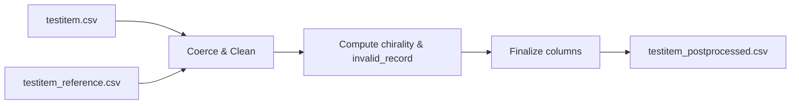

# Test Item Post-processing Lineage Report

## A. Краткий итог
1. CLI-скрипт `scripts/get_testitem_data.py` читает конфигурацию, грузит три CSV (testitem, reference, activity) и передаёт их в `normalize_testitem`. 【F:scripts/get_testitem_data.py†L19-L39】
2. Основная логика живёт в `library/transforms/testitem.py::normalize_testitem`; parent-молекулы не обрабатываются. 【F:library/transforms/testitem.py†L79-L225】
3. Используются только настройки `cleaning.sort_pipes`, `pipeline.testitem.invalid_rules`, `pipeline.testitem.chirality_reference`, `pipeline.testitem.skeleton_length`, `pipeline.testitem.type_map`, `pipeline.testitem.column_order`. 【F:library/transforms/testitem.py†L102-L217】
4. Словари из `dictionary/` и `dictionary_testitem/` не читаются; parent-поля отсутствуют. 【F:library/transforms/testitem.py†L85-L225】
5. Входы нормализуются по типам и текстам; производится очистка pipe-строк и расчёт `unknown_chirality`. 【F:library/transforms/testitem.py†L85-L196】
6. Проверка `invalid_record` базируется на ожиданиях из конфигурации и наличии InChI Key. 【F:library/transforms/testitem.py†L148-L177】
7. Поле `skeleton_inchi_key` усечено до `pipeline.testitem.skeleton_length` символов. 【F:library/transforms/testitem.py†L179-L196】
8. Дедупликация и join'ы не выполняются; `activity` вход не используется. 【F:library/transforms/testitem.py†L79-L225】
9. Выход сортируется лишь опосредованно (через порядок колонок); ключевой уникальности не задан. 【F:library/transforms/testitem.py†L212-L225】
10. Отсутствие parent-логики требует доработки: нет вычислений `parent_molecule_chembl_id`, `parent_source`, `quality_flag`. 【F:library/transforms/testitem.py†L85-L225】

## B. Подробный отчёт

### 1. Точки входа и зависимости
- Модуль запускается как CLI: `python scripts/get_testitem_data.py --config <path> [--out <path>]`. 【F:scripts/get_testitem_data.py†L19-L48】
- Импортирует `library.config.load_config`, `library.io.read_csv/write_csv`, `library.transforms.testitem.normalize_testitem`. 【F:scripts/get_testitem_data.py†L12-L47】
- Глобальный `PROJECT_ROOT` добавляется в `sys.path` для поиска внутренних библиотек. 【F:scripts/get_testitem_data.py†L8-L14】

### 2. Внутренние зависимости и конфигурация
- Загрузка конфигурации через `load_config(Path(args.config))`. 【F:scripts/get_testitem_data.py†L25-L26】
- Используемые ключи `config`:
  - `files.testitem_csv`, `files.testitem_reference_csv`, `files.activity_csv` (пути входов). 【F:scripts/get_testitem_data.py†L28-L30】
  - `outputs.dir` для дефолтного пути. 【F:scripts/get_testitem_data.py†L41-L45】
  - `cleaning.sort_pipes`. 【F:library/transforms/testitem.py†L102-L114】
  - `pipeline.testitem.invalid_rules.molecule_type` и `.structure_type`. 【F:library/transforms/testitem.py†L148-L175】
  - `pipeline.testitem.chirality_reference`. 【F:library/transforms/testitem.py†L138-L146】
  - `pipeline.testitem.skeleton_length`. 【F:library/transforms/testitem.py†L179-L187】
  - `pipeline.testitem.type_map` и `.column_order`. 【F:library/transforms/testitem.py†L212-L223】
- Параметр `activity` читается, но далее не используется. 【F:library/transforms/testitem.py†L79-L225】

### 3. Входные источники и схемы
| Имя | Конфиг-ключ | Формат | Схема после `_prepare_reference`/`coerce_types` | Nullable | Примечания |
|-----|-------------|--------|-----------------------------------------------|----------|-----------|
| testitem | `files.testitem_csv` | CSV | `molecule_chembl_id` string, `pref_name` string, `all_names` string, `molecule_structures.canonical_smiles` string, `molecule_type` string, `structure_type` string, `is_radical` boolean, `molecule_structures.standard_inchi_key` string, `standard_inchi_key` string, `unknown_chirality` string, `nstereo` Int64, `document_chembl_id` string | все nullable | Схема задаётся `base_schema`, затем доводится до типов. 【F:library/transforms/testitem.py†L85-L101】
| testitem_reference | `files.testitem_reference_csv` | CSV | `molecule_chembl_id` string, `all_names` string, `nstereo` Int64 | `molecule_chembl_id` non-null после фильтра | Используется для перезаписи `all_names`/`nstereo`. 【F:library/transforms/testitem.py†L30-L76】
| activity | `files.activity_csv` | CSV | Не используется; загрузка только для соответствия интерфейсу. | - | Нет вызовов. 【F:scripts/get_testitem_data.py†L28-L38】【F:library/transforms/testitem.py†L79-L225】

Таблицы ChEMBL-иерархий и словари `dictionary_testitem/` нигде не читаются — подтверждённым кодом отсутствуют. 【F:library/transforms/testitem.py†L85-L225】

### 4. Приоритеты источников parent_molecule_chembl_id
**Не реализовано.** В коде нет чтения `dictionary_testitem/molecule_hierarchy.csv`, нет вычислений `parent_molecule_chembl_id`. Требуются дополнительные исходники для анализа. 【F:library/transforms/testitem.py†L85-L225】

### 5. Карта пайплайна по стадиям
| Stage | Описание | Псевдокод | Ссылки |
|-------|----------|-----------|--------|
| S1 | Загрузка CSV и конфигурации | `config = load_config(path); df = read_csv(key, config)` | 【F:scripts/get_testitem_data.py†L25-L38】
| S2 | Подготовка справочника | `_prepare_reference(testitem_reference)` | 【F:library/transforms/testitem.py†L30-L76】
| S3 | Нормализация типов и применение справочника | `typed = coerce_types(testitem, base_schema); typed = _apply_reference(typed, reference)` | 【F:library/transforms/testitem.py†L85-L117】
| S4 | Очистка текстов и pipe-значений | `normalize_string`, `normalize_pipe` | 【F:library/transforms/testitem.py†L106-L115】
| S5 | Формирование `canonical_smiles` и вычисление `unknown_chirality` | выбор столбца + `_compute_unknown_chirality` | 【F:library/transforms/testitem.py†L121-L146】
| S6 | Флаги качества `invalid_record` | `_compute_invalid` через ожидания типов и наличие InChI | 【F:library/transforms/testitem.py†L148-L177】
| S7 | Вычисление `skeleton_inchi_key` | `_compute_skeleton` | 【F:library/transforms/testitem.py†L179-L196】
| S8 | Очистка и финальное доведение типов | drop лишних колонок, `ensure_columns`, `coerce_types` | 【F:library/transforms/testitem.py†L198-L225】
| S9 | Запись в CSV | `write_csv(result, output_path)` | 【F:scripts/get_testitem_data.py†L41-L50】

### 6. Нормализация полей и алиасы
- `pref_name` нормализуется через `normalize_string` (trim + lower). 【F:library/transforms/testitem.py†L106-L108】
- `all_names` обрабатывается через `normalize_pipe` с сортировкой (casefold, trim, dedup, alias/drop из config пока не передаются). 【F:library/transforms/testitem.py†L109-L115】【F:library/transforms/common.py†L52-L117】
- `canonical_smiles` — копия первого доступного столбца из списка кандидатов, тип string. 【F:library/transforms/testitem.py†L121-L136】
- `unknown_chirality` — булево, True если `nstereo` отличается от `chirality_reference`. 【F:library/transforms/testitem.py†L138-L146】
- Проверка формата CHEMBL-ID отсутствует; нормализация паттерна `^CHEMBL\d+$` не выполняется. (UNKNOWN)
- Логика соли/сольватов/смесей отсутствует. (UNKNOWN)

### 7. Джойны и ключи соответствия
Фактические merge-операции отсутствуют. Lookup `reference_index` выполняется через `Series.map`.

| Stage | Left | Right | Ключи | Тип | Кардинальность | Пред-/постфильтры | Конфликты |
|------:|------|-------|-------|-----|----------------|-------------------|-----------|
| S3 | `typed` | `reference_index` (Series) | `molecule_chembl_id` | map (аналог left join) | 1:0..1 | фильтрация null в `_prepare_reference` | Значения из reference приоритетнее, иначе исходные. 【F:library/transforms/testitem.py†L47-L76】

### 8. Вычисляемые и агрегированные поля
- `unknown_chirality`: `bool`, `nstereo != chirality_reference`. 【F:library/transforms/testitem.py†L138-L146】
- `invalid_record`: `not (molecule_type == expected and structure_type == expected and inchi_key != "")`. 【F:library/transforms/testitem.py†L148-L177】
- `skeleton_inchi_key`: первые `skeleton_length` символов `standard_inchi_key`. 【F:library/transforms/testitem.py†L179-L196】
- Другие поля копируются/очищаются. Поля `parent_*` отсутствуют. 【F:library/transforms/testitem.py†L198-L225】

### 9. Фильтры качества и исключения
- Явных фильтров (drop) нет.
- `invalid_record` вычисляется, но не используется для фильтрации.
- Логирование только начальное. 【F:library/transforms/testitem.py†L79-L177】

### 10. Дедупликации и уникальность
- Дедупликация не выполняется; уникальность `molecule_chembl_id` не гарантируется. 【F:library/transforms/testitem.py†L79-L225】

### 11. Линейдж колонок
| OutputColumn | Тип | Source(s) | Трансформация | Nullable | Ограничения | Пример |
|--------------|-----|-----------|---------------|----------|-------------|--------|
| molecule_chembl_id | string | `testitem.molecule_chembl_id` | прямое копирование | true | нет проверки паттерна | chembl25 → chembl25 (case сохраняется) |
| pref_name | string | `testitem.pref_name` | `normalize_string` (trim+lower) | true | пустые → NA | "Paracetamol" → "paracetamol" |
| all_names | string | `testitem_reference` override → `normalize_pipe` | true | сортировка, dedup | "Name A | name b" → "name a|name b" |
| standard_inchi_key | string | вход | копия | true | - | неизменён |
| canonical_smiles | string | `canonical_smiles` или `molecule_structures.canonical_smiles` | копия первого доступного столбца | true | - | неизменён |
| skeleton_inchi_key | string | `standard_inchi_key` | усечение `[:skeleton_length]` | true | длина ≤ конфигурации | "ABCDEFGHIJKL..." → "ABCDEFGHIJKLMN" |
| unknown_chirality | boolean | `nstereo` + конфиг | `nstereo != chirality_reference` | true | вывод `False` при NaN | 3 vs ref 1 → True |
| invalid_record | boolean | `molecule_type`, `structure_type`, `standard_inchi_key`/`molecule_structures.standard_inchi_key` | логическое правило | false (по привидению) | требует непустого InChI key и соответствия типам | пустой InChI → True |

`parent_molecule_chembl_id`, `parent_source`, `quality_flag` отсутствуют — требуется реализация. 【F:library/transforms/testitem.py†L198-L223】

### 12. Сортировка и вывод
- Запись через `write_csv` без явной сортировки; порядок колонок определяется `column_order`. 【F:scripts/get_testitem_data.py†L41-L50】【F:library/transforms/testitem.py†L212-L225】
- Итоговый путь: `outputs.dir/testitem_postprocessed.csv` (можно переопределить `--out`). 【F:scripts/get_testitem_data.py†L41-L48】

### 13. Производительность
- Отсутствуют join'ы по большим наборам — минимальная нагрузка.
- Возможные улучшения: убрать двойное чтение `chirality_reference` (строки 138-146), отказаться от `apply` для `invalid_record` (переписать на векторные операции), использовать `Series.str.slice` для skeleton. 【F:library/transforms/testitem.py†L138-L196】
- Кэширование справочников не требуется при текущем объёме, но добавление parent-логики потребует индексированных lookup'ов.

### 14. Качество и ошибки
- Нет валидации CHEMBL-ID, циклов parent/child не проверяется (parent-логика отсутствует).
- `testitem_reference` пустой → graceful (возвращается пустая таблица). 【F:library/transforms/testitem.py†L36-L76】
- При пропавших обязательных колонках `ensure_columns` добавит NA.
- Логирование ограничено `logger.info` при старте. 【F:library/transforms/testitem.py†L83-L84】

### 15. Тестовые примеры
- Покрытие всех веток parent невозможно — функциональность отсутствует. Требуются дополнительные примеры после реализации.
- Мини-инпуты для существующей логики:
  1. `nstereo` = reference → `unknown_chirality=False`.
  2. Пустой InChI → `invalid_record=True`.
  3. Pipe-строка с дублями → `normalize_pipe` сортирует.

## C. Таблица джойнов
*(см. пункт 7; дополнительных join'ов нет).* 【F:library/transforms/testitem.py†L47-L76】

## D. JSON-артефакт
```json
{
  "inputs": [
    {
      "name": "testitem",
      "path": "config.files.testitem_csv",
      "schema": [
        ["molecule_chembl_id", "string", true],
        ["pref_name", "string", true],
        ["all_names", "string", true],
        ["molecule_structures.canonical_smiles", "string", true],
        ["molecule_type", "string", true],
        ["structure_type", "string", true],
        ["is_radical", "boolean", true],
        ["molecule_structures.standard_inchi_key", "string", true],
        ["standard_inchi_key", "string", true],
        ["unknown_chirality", "string", true],
        ["nstereo", "Int64", true],
        ["document_chembl_id", "string", true]
      ]
    },
    {
      "name": "testitem_reference",
      "path": "config.files.testitem_reference_csv",
      "schema": [
        ["molecule_chembl_id", "string", false],
        ["all_names", "string", true],
        ["nstereo", "Int64", true]
      ]
    }
  ],
  "stages": [
    {
      "id": "S3",
      "desc": "Apply reference overrides and normalize testitem fields",
      "code_refs": ["library/transforms/testitem.py:85-196"]
    }
  ],
  "columns": [
    {
      "output": "canonical_smiles",
      "sources": ["testitem.canonical_smiles", "testitem.molecule_structures.canonical_smiles"],
      "transform": "first available candidate, cast to string",
      "nullable": true
    },
    {
      "output": "unknown_chirality",
      "sources": ["testitem.nstereo", "config.pipeline.testitem.chirality_reference"],
      "transform": "nstereo differs from reference",
      "nullable": true
    },
    {
      "output": "invalid_record",
      "sources": ["testitem.molecule_type", "testitem.structure_type", "testitem.standard_inchi_key", "testitem.molecule_structures.standard_inchi_key"],
      "transform": "fails expected molecule/structure type or has empty InChI",
      "nullable": false
    }
  ],
  "joins": [
    {
      "left": "testitem",
      "right": "testitem_reference",
      "keys": ["molecule_chembl_id"],
      "type": "left",
      "note": "implemented via Series.map"
    }
  ],
  "config_used": [
    "files.testitem_csv",
    "files.testitem_reference_csv",
    "files.activity_csv",
    "outputs.dir",
    "cleaning.sort_pipes",
    "pipeline.testitem.invalid_rules",
    "pipeline.testitem.chirality_reference",
    "pipeline.testitem.skeleton_length",
    "pipeline.testitem.type_map",
    "pipeline.testitem.column_order"
  ],
  "outputs": [
    {
      "path": "outputs.dir/testitem_postprocessed.csv",
      "primary_key": []
    }
  ],
  "gaps": [
    "parent_molecule_chembl_id resolution not implemented"
  ]
}
```

## E. Диаграмма потока


## F. Команды подтверждения
- `rg -n "read_csv|read_parquet" scripts/get_testitem_data.py` 【663e23†L1-L5】
- `rg -n "parent_molecule_chembl_id|molecule_hierarchy|dictionary_testitem" -S` 【dafdb2†L1-L2】
- `rg -n "merge|apply|map|join" scripts/get_testitem_data.py` 【dabf5f†L1-L2】
- `rg -n "CHEMBL\\d+" -S` (показал попадания в исходных данных, не в коде). 【5c13f6†L1-L120】
